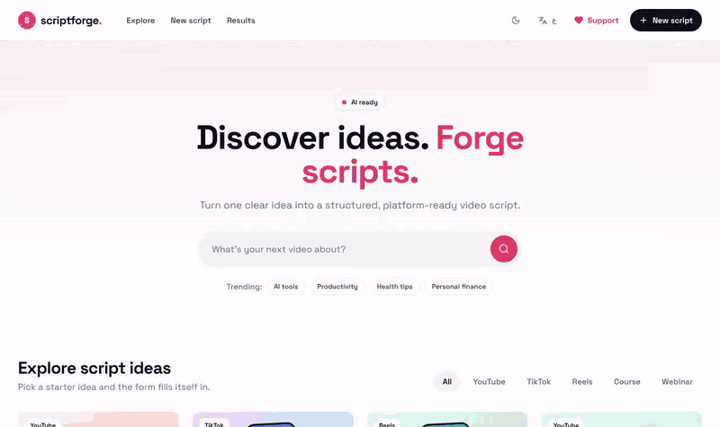
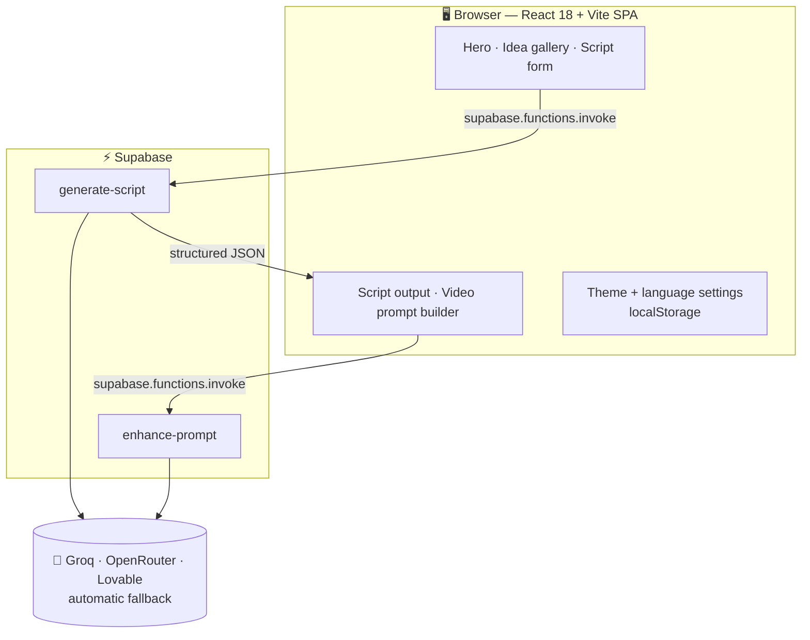
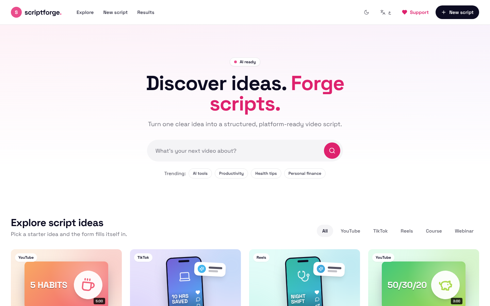
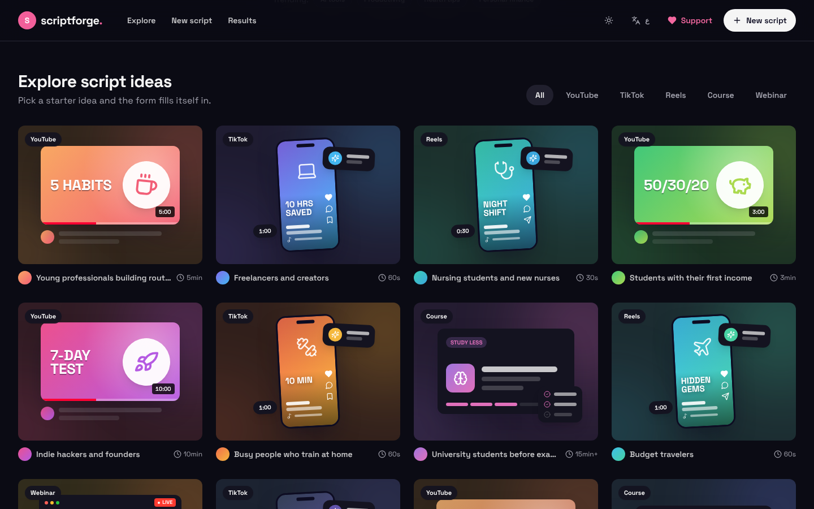
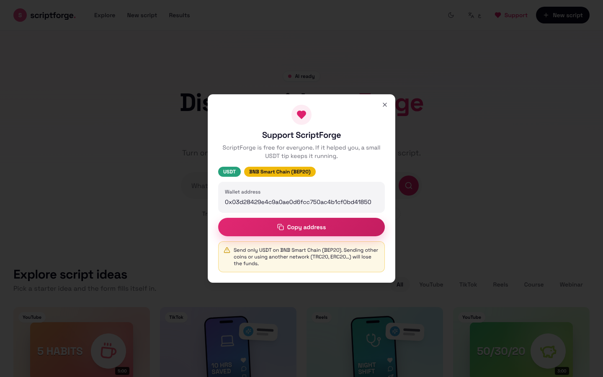
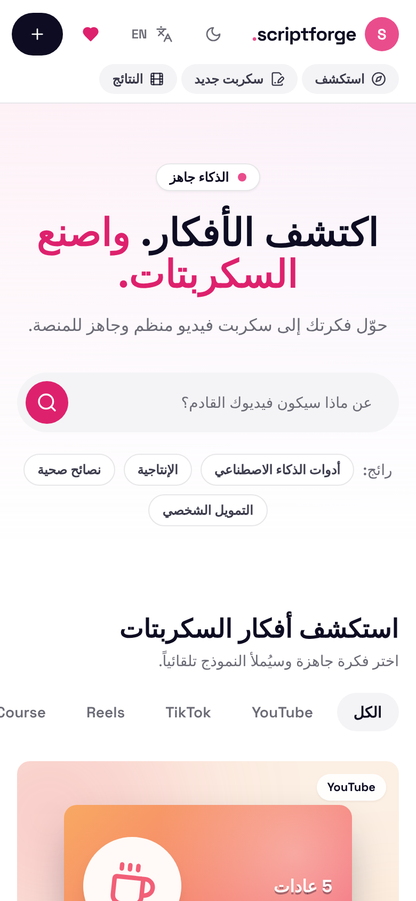

<p align="center">
  <a href="https://scriptforgeaii.lovable.app/">
    
  </a>
</p>

<p align="center">
  <a href="https://scriptforgeaii.lovable.app/"></a>
  
  
</p>

<p align="center">
  
  
  
  
  
  
</p>

<h3 align="center">Turn one idea into a platform-ready video script — hook, timestamps, B-roll, CTA and SEO tags — in seconds.</h3>

<p align="center">
  <a href="https://scriptforgeaii.lovable.app/"><b>Try it live</b></a> ·
  <a href="#-features">Features</a> ·
  <a href="#-how-it-works">How it works</a> ·
  <a href="#-run-it-locally">Run locally</a> ·
  <a href="#-بالعربي">بالعربي</a>
</p>

<br/>

<p align="center">
  
</p>

---

## 💡 Why ScriptForge

> **Blank page → filmable script.** ScriptForge structures your idea the way short-form and long-form creators actually shoot: a scroll-stopping hook first, timed sections with visual direction, then a clear call to action.

- **Made for each platform** — pacing and length adapt to YouTube, TikTok, Reels, online courses and webinars.
- **Script to video** — turn the finished script into a detailed, scene-by-scene prompt for AI video tools.
- **Open to everyone** — no account, no paywall, full English & Arabic (RTL) support.

---

## ✨ Features

<table>
  <tr>
    <td width="33%" valign="top">
      <h4>🎬 Script generator</h4>
      Title options, a typed hook, timestamped sections with dialogue, visual direction and B-roll, a CTA, SEO tags and retention notes.
    </td>
    <td width="33%" valign="top">
      <h4>🎥 Video prompt builder</h4>
      Edit the hook and script, then build a production-ready prompt for text-to-video models — copy it in one click.
    </td>
    <td width="33%" valign="top">
      <h4>🧭 Idea gallery</h4>
      Dribbble-style starter ideas with platform mockups. Filter by platform; one click fills the whole form.
    </td>
  </tr>
  <tr>
    <td valign="top">
      <h4>📎 Bring your sources</h4>
      Add a video link, paste an article or transcript, or upload an image to ground the script.
    </td>
    <td valign="top">
      <h4>🌍 English · العربية</h4>
      Generate in English, Arabic or both. The interface switches to a native right-to-left layout.
    </td>
    <td valign="top">
      <h4>🌗 Light & dark</h4>
      A clean white/ink/pink design system with semantic tokens, responsive down to small phones.
    </td>
  </tr>
</table>

**Controls you get:** platform (YouTube · TikTok · Reels · Course · Webinar) · duration (30s → 15+ min) · tone (educational, entertaining, dramatic, casual, motivational) · target audience · key message.

---

## 🧠 How it works




---

## 📸 Screenshots

<table>
  <tr>
    <td width="50%"><p align="center"><sub>Hero & search — light</sub></p></td>
    <td width="50%"><p align="center"><sub>Idea gallery — dark</sub></p></td>
  </tr>
  <tr>
    <td><p align="center"><sub>Support dialog</sub></p></td>
    <td align="center"><p align="center"><sub>Mobile — Arabic (RTL)</sub></p></td>
  </tr>
</table>

---

## 🛠️ Tech stack

| Layer | Tools |
|---|---|
| **UI** | React 18, TypeScript, Vite, Tailwind CSS, shadcn/ui (Radix), Framer Motion, Lucide icons |
| **Backend** | Supabase Edge Functions (Deno): `generate-script`, `enhance-prompt` |
| **AI** | Open-weight models via **Groq** (`openai/gpt-oss-120b`, free tier) → **OpenRouter** free models → Lovable AI Gateway, with automatic fallback |
| **Quality** | ESLint, Vitest, Testing Library, Playwright |
| **Hosting** | Lovable |

---

## 🚀 Run it locally

**Requirements:** Node.js 18+ and npm (or Bun), plus a Supabase project for the edge functions.

```bash
git clone https://github.com/3h0ll7/scriptforge-ai.git
cd scriptforge-ai
cp .env.example .env      # fill in your Supabase URL + publishable key
npm install
npm run dev               # http://localhost:8080
```

```env
VITE_SUPABASE_URL=https://your-project-ref.supabase.co
VITE_SUPABASE_PUBLISHABLE_KEY=replace-with-your-supabase-publishable-key
```

<details>
<summary><b>Deploying the edge functions</b></summary>

```bash
npx supabase link --project-ref your-project-ref
npx supabase db push
npx supabase functions deploy generate-script
npx supabase functions deploy enhance-prompt
```

Both functions share `supabase/functions/_shared/ai.ts`, which tries each configured provider in order and moves on when one is out of credits, rate-limited or has retired a model. Set at least one key as a Supabase secret — never in `.env` or in git:

| Secret | Provider | Default models (strongest first) |
|---|---|---|
| `GROQ_API_KEY` | [Groq](https://console.groq.com/keys) — free tier | `openai/gpt-oss-120b`, `openai/gpt-oss-20b`; images: `qwen/qwen3.8-27b` → `llama-4-scout` |
| `OPENROUTER_API_KEY` | [OpenRouter](https://openrouter.ai/keys) — free models | `openai/gpt-oss-120b:free`, `deepseek/deepseek-chat-v3.1:free` |
| `LOVABLE_API_KEY` | Lovable AI Gateway (paid credits) | `google/gemini-3-flash-preview` |

Override any model list with comma-separated `GROQ_MODELS`, `GROQ_VISION_MODELS`, `OPENROUTER_MODELS` or `OPENROUTER_VISION_MODELS`.

```bash
npx supabase secrets set GROQ_API_KEY=your-groq-key
```

</details>

| Command | What it does |
|---|---|
| `npm run dev` | Start the dev server on port 8080 |
| `npm run build` | Production build into `dist/` |
| `npm run preview` | Serve the production build |
| `npm run lint` | ESLint |
| `npm test` | Vitest |

---

## 📁 Project structure

```
scriptforge-ai/
├── docs/                       # README banner, demo GIF, screenshots
├── public/                     # Static assets
├── src/
│   ├── components/
│   │   ├── IdeaGallery.tsx     # Filterable starter ideas
│   │   ├── IdeaShot.tsx        # Platform mockup thumbnails
│   │   ├── ScriptForm.tsx      # Script parameters (accepts presets)
│   │   ├── ScriptOutput.tsx    # Generated script view
│   │   ├── VideoPromptBuilder.tsx
│   │   ├── SupportDialog.tsx   # USDT donation dialog
│   │   └── ui/                 # shadcn/ui primitives
│   ├── hooks/useAppSettings.tsx # Theme, language, EN/AR strings
│   ├── lib/                    # generateScript, idea templates, donation config
│   ├── pages/Index.tsx         # Hero · gallery · workspace
│   └── index.css               # Design tokens (light/dark)
├── supabase/
│   ├── functions/              # Edge functions
│   └── migrations/
└── AGENTS.md                   # Architecture rules for contributors & agents
```

---

## 🗺️ Roadmap

- [x] Script generation for YouTube, TikTok, Reels, courses & webinars
- [x] Video prompt builder
- [x] English & Arabic with RTL
- [x] Dribbble-inspired redesign, idea gallery, dark mode
- [x] Free public access, optional donations
- [ ] Save & export scripts (PDF / Markdown)
- [ ] More idea templates and niches
- [ ] Shareable script links
- [ ] Voice-over generation

---

## ❤️ Support the project

ScriptForge is free. If it saves you time, you can send a tip in **USDT on BNB Smart Chain (BEP20)**:

```
0x03d28429e4c9a0ae0d6fcc750ac4b1cf0bd41850
```

> ⚠️ Send **only USDT on BEP20**. Other coins or networks (TRC20, ERC20…) will be lost.

---

## 🇮🇶 بالعربي

<details>
<summary><b>اضغط لعرض الوصف بالعربي</b></summary>

<div dir="rtl">

### ScriptForge AI

حوّل فكرة واحدة إلى **سكربت فيديو جاهز للتصوير** خلال ثوانٍ: خطّاف (Hook) يوقف التمرير، أقسام بتوقيت زمني مع توجيه بصري ولقطات B-roll، دعوة للعمل، ووسوم SEO.

**المميزات**
- سكربتات مخصّصة لـ YouTube و TikTok و Reels والدورات والندوات.
- مُنشئ برومبت فيديو مفصّل مشهداً بمشهد لأدوات توليد الفيديو بالذكاء الاصطناعي.
- معرض أفكار جاهزة يملأ النموذج بضغطة واحدة.
- إرفاق رابط فيديو أو نص أو صورة كمصدر.
- واجهة عربية كاملة من اليمين لليسار، ووضع فاتح وداكن.
- مجاني بالكامل وبدون تسجيل دخول.

**التشغيل محلياً**

</div>

```bash
git clone https://github.com/3h0ll7/scriptforge-ai.git
cd scriptforge-ai && cp .env.example .env && npm install && npm run dev
```

<div dir="rtl">

**ادعم المشروع:** USDT على شبكة **BEP20** فقط — العنوان موجود في قسم *Support the project* أعلاه.

</div>
</details>

---

## 🤝 Contributing

Issues and pull requests are welcome. Please read [`AGENTS.md`](AGENTS.md) for the architecture rules, keep changes small, and run `npm run lint && npm test && npm run build` before opening a PR.

## 📜 License

No license file has been added yet, so all rights are reserved by the author by default.

---

<p align="center">
  Built by <a href="https://hassanaii.lovable.app"><b>Hassan Salman</b></a> with <a href="https://lovable.dev">Lovable</a>, <a href="https://supabase.com">Supabase</a> and <a href="https://ui.shadcn.com">shadcn/ui</a>.<br/><br/>
  <a href="https://scriptforgeaii.lovable.app/"></a>
</p>
